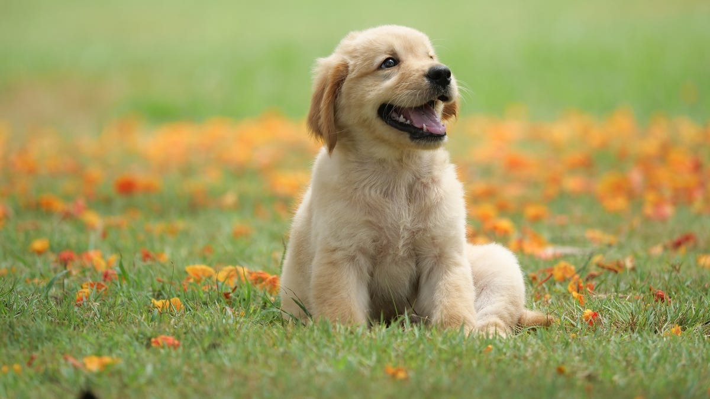
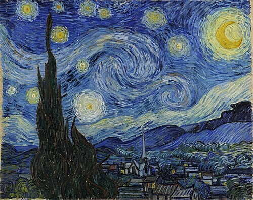
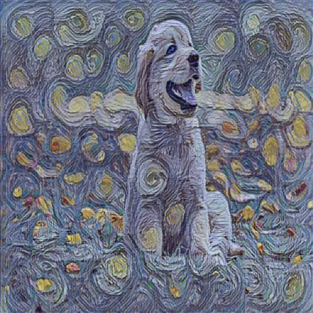

# 🚀 AI Art Generator ULTRA PRO™

The Ultimate Universal AI Style Transfer Studio™ 🎨  
Create stunning, next-gen AI artworks from any photo + any style image!  
Whether it's Van Gogh, The Scream, Anime, Cyberpunk, OR your own style image — this app does it all.

---

## 💎 Features
- Upload any **content image** 📸
- Choose from **preloaded famous paintings** 🎨 OR upload your own custom style image
- Control **style intensity with a slider** 🎚️
- Download your masterpiece instantly 💾
- Clean, futuristic **next-gen dark UI** (with Orbitron font & neon glowing buttons)

> This is an AI demo project built with ❤️ to showcase real-world AI + product design skills.

---

## 🛠️ Tech Stack
- Python 🐍
- TensorFlow + TensorFlow Hub
- Streamlit
- PIL / Numpy

---

## 📥 Installation

### 1️⃣ Clone this repo
```
git clone https://github.com/VanujaDesilva/AI_Art_Generator_ULTRA_PRO.git
cd AI_Art_Generator_ULTRA_PRO
```

### 2️⃣ Install dependencies
```
pip install -r requirements.txt
```

### 3️⃣ Run the app
```
streamlit run app.py
```

👉 App will open at `http://localhost:8501/`

---

## 🎨 How to Use

1. Upload your content image  
2. Check the box to upload your **own style image** OR choose a style from the preloaded gallery  
3. Adjust the **style strength**  
4. Click "**💥 Generate AI Artwork 💥**"  
5. Download your artwork 💎

---

## 📋 Preloaded Styles
Place these images in `/assets/` folder:
- `starry_night.jpg`
- `the_scream.jpg`
- `mona_lisa.jpg`
- `candy.jpg`

👉 Download free artworks from [WikiArt](https://www.wikiart.org/) or [Google Arts & Culture](https://artsandculture.google.com/).

---

## 🔥 Example

| Content Image | Style Image | AI Artwork |
|---------------|-------------|------------|
|  |  |  |

---

## 🎯 Ideas for Future Add-ons
- Add Anime / Cyberpunk / Cartoon styles  
- Add "Share to social media" button  
- Create an API version of the app  
- Deploy on Streamlit Cloud

---

## 💎 Credits
- Style Transfer model: [Magenta by Google](https://tfhub.dev/google/magenta/arbitrary-image-stylization-v1-256/2)
- Font: [Orbitron by Google Fonts](https://fonts.google.com/specimen/Orbitron)

---

## 🏆 License
MIT License

---

## 👤 Author
Built by [Vanuja De Silva](https://github.com/VanujaDesilva) with ❤️  
> “Stay LITT, Stay Futuristic” 😎🚀

# AI-Art-Generator-ULTRA-PRO-
" AI Art Generator ULTRA PRO™ " The Ultimate Universal AI Style Transfer Studio. Upload any photo + choose any style (or upload your own!) to create next-gen AI artwork instantly. Built with Python, TensorFlow &amp; Streamlit.

